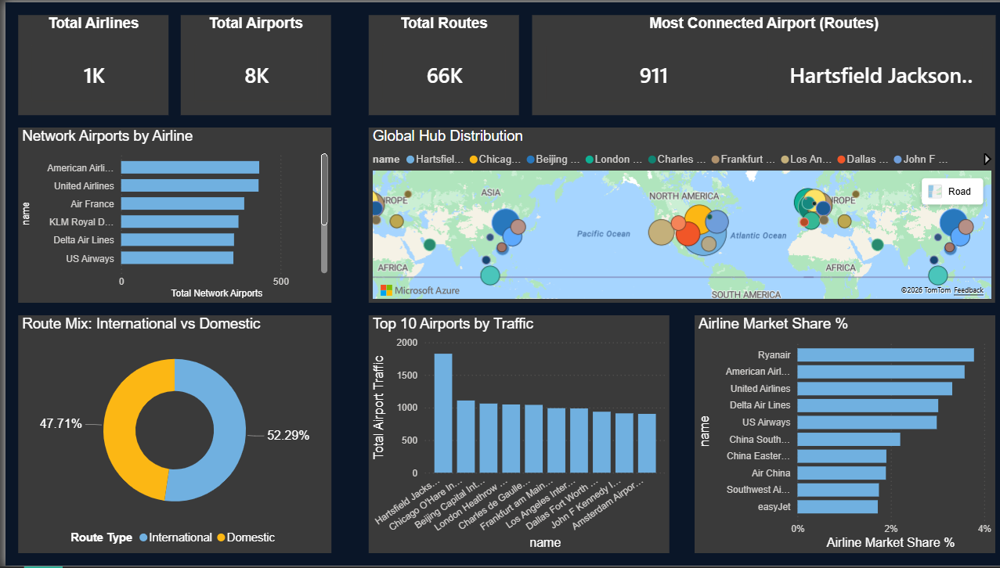

 Global Airport Network Dashboard
 
An end-to-end data analytics project exploring global airport traffic, airline market share, and international vs domestic route distribution — built with **PostgreSQL** and **Power BI**.
 

 
---
 
##  Project Overview
 
This project analyzes a global aviation dataset to uncover key insights about the structure of the worldwide airport network. The full pipeline covers raw data ingestion, relational database modeling in PostgreSQL, data cleaning, and interactive dashboard development in Power BI.
 
**Key questions explored:**
- Which airlines have the largest airport networks?
- Which airports handle the most traffic globally?
- How is the route mix split between international and domestic travel?
- How fragmented is airline market share across the global network?
 
---
 
##  Key Findings
 
| Metric | Value |
|---|---|
| Top airline market share | 3.75% (Ryanair) — highly fragmented market |
| International routes | 52.29% of all routes |
| Busiest airport | Hartsfield-Jackson Atlanta (ATL) |
| Airlines tracked | 1,000+ |
| Airports tracked | 8,000+ |
| Total routes | 66,000+ |
 
---
 
## Tools & Skills Used
 
| Tool | Usage |
|---|---|
| **PostgreSQL** | Data storage, relational modeling, querying |
| **pgAdmin 4** | Database management and schema design |
| **Power BI Desktop** | Data modeling, DAX measures, dashboard design |
| **Github** | Source of raw aviation dataset |
 
---
 
##  Project Structure
 
```
global-airport-network-dashboard/
│
├── data/
│   └── raw/                  # Original data files from Github
│
├── database/
│   └── schema.sql            # PostgreSQL schema definition
│
├── dashboard/
│   └── airport_project_dashboard.pbix   # Power BI dashboard file
│
└── README.md
```
 
---
 
##  Database Schema
 
The PostgreSQL database consists of 5 tables sourced from the Github dataset:
 
| Table | Description |
|---|---|
| `public.airports` | Airport names, locations, IATA codes |
| `public.airlines` | Airline names and identifiers |
| `public.routes` | Route data including origin, destination, and type |
| `public.airplanes` | Aircraft types used across the network |
| `public.countries` | Country reference data |
 
See [`database/schema.sql`](database/schema.sql) for the full schema.
 
---
 
##  Dashboard Features
 
The Power BI dashboard includes:
 
- **KPI Cards** — Total routes, airlines, airports, and most connected airport at a glance
- **Network Airports by Airline** — Horizontal bar chart ranking airlines by network size
- **Top 10 Airports by Traffic** — Column chart of the world's busiest airports
- **Route Mix Donut Chart** — International vs domestic route split
- **Airline Market Share %** — Ranked bar chart showing how fragmented the market is
- **Global Hub Distribution Map** — Bubble map showing traffic concentration worldwide
 

---
 
##  Data Source
 
- The raw data was sourced from OpenFlights.org datasets, which include global airport, airline, and route information. 
---
 
##  What I Learned
 
- Designing and querying a normalized relational schema in PostgreSQL across multiple related tables
- Cleaning and transforming raw CSV data into a structured database
- Building DAX measures in Power BI for KPIs like market share percentage and distinct counts
- Designing a professional  dashboard with consistent visual hierarchy and clear data storytelling
- Structuring an end-to-end analytics project for a professional portfolio
 
